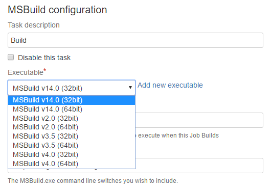

MSBuild
#######

Executable
----------

We have different options available:

- MSBuild v14.0
- MSBuild v2.0
- MSBuild v3.5
- MSBuild v4.0

Both in 32 and 64 bit versions

Please note that you can explicitly configure a specific framework version using `TargetFrameworkVersion` parameter
For example

.. code-block:: bash

    /p:TargetFrameworkVersion=v2.0;Configuration=Release

Parameters
----------

By default MSBuild compiles the solution in Debug mode. You can explictly define the configuration with the `Configuration` parameter. For example:

.. code-block:: bash

    /p:Configuration=Release

Another interesting parameter is `/m` which specifies the maximum number of concurrent processes to build with. If not present MSBuild will build the projects in the solution one at a time. If present but not configured MSBuild will use up to the number of processors on the computer.  

.. note:: An extensive list of MSBuild parameters can be found at `MSDN <https://msdn.microsoft.com/en-us/library/ms164311.aspx>`_

 