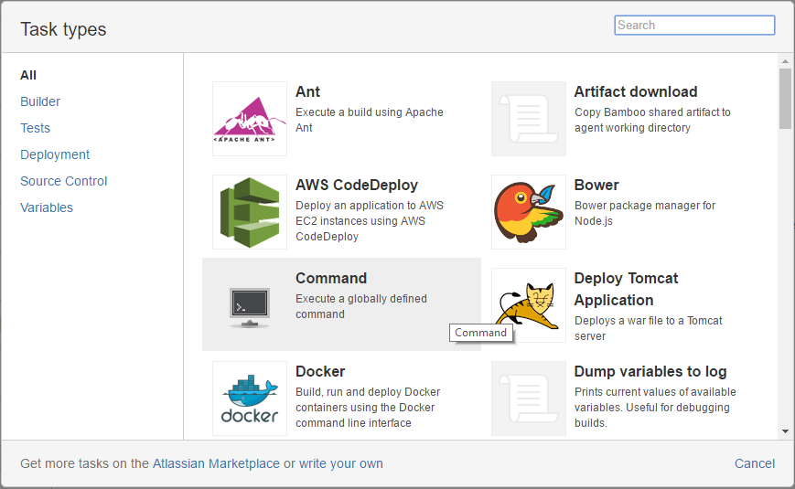
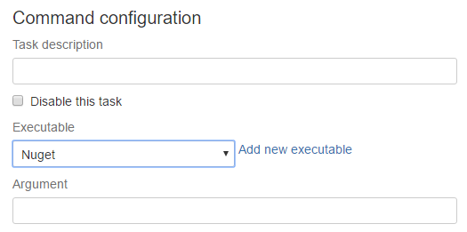

Nuget
#####

From Nuget 2.7+ and Visual Studio 2015 the default option to restore packages in a solution is Automatic Package Restore. Previously Visual Studio usually includes a .nuget folder with a copy of nuget.exe. With the current default option you need to explicitely run nuget restore before a build.  

Command
-------

One way to execute Nuget in Bamboo is using a command task:

and configuring Nuget as Executable

You can restore packages with the `restore` argument or install new packages with `install`. For Example if you want to install the latest OpenCover package you have to configure as argument `install OpenCover` and it will download and create an OpenCover folder with the package content in the current directory. By default the current directory is the Bamboo working directory ``${bamboo.build.working.directory}`` you can change it specifying a Working sub directory in the same task.

System Path
-----------

Nuget is also included in the Path environment variable. Then for example you can call it from a script task:

.. code-block:: bat

    nuget restore
    nuget install Newtonsoft.Json

Local Nuget
-----------

If for some reason you need the latest and greatest nuget version you can download it using the following script. 

.. code-block:: powershell

    $sourceNugetExe = "https://dist.nuget.org/win-x86-commandline/latest/nuget.exe"
    $targetNugetExe = "${bamboo.build.working.directory}\nuget.exe"
    Invoke-WebRequest $sourceNugetExe -OutFile $targetNugetExe
    Set-Alias nuget $targetNugetExe -Scope Global -Verbose

.. note:: Remember to check the Run as Powershell script option in the Bamboo script task.