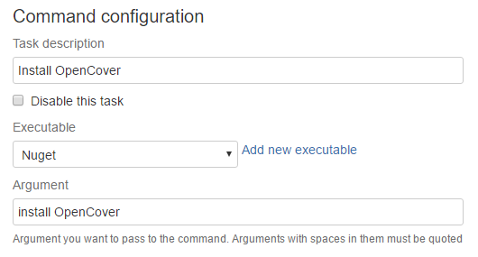

Summary
#######

OpenCover is a code coverage tool for .NET 2 and above (WINDOWS OS only), support for 32 and 64 processes with both branch and sequence points.

OpenCover as a Bamboo Command
-----------------------------

Discussed with details in a different article [Link]

OpenCover from System Path
--------------------------

OpenCover is in all the Windows Agents System path. Then for example you can create a script task that calls OpenCover.exe directly.

.. code-block:: bat

     OpenCover.Console.exe -register:user -target:"${bamboo.build.working.directory}\packages\xunit.runner.console.2.1.0\tools\xunit.console.exe" -targetargs:"${bamboo.build.working.directory}\MyProject.Tests\bin\Debug\MyProject.Tests.dll" -filter:"+[*]* -[*.Tests]* -[*.Test]* -[xunit.*]* -[Microsoft.*]*" -output:${bamboo.build.working.directory}\open-cover.xml

.. note:: Note that in the previous example we assume xunit.runner.console nuget package is present. We can configure it as a reference of a project or explicitly install it in a previous step using Nuget command.   

You can find a extensive list of command line arguments in the following `OpenCover wiki page <https://github.com/opencover/opencover/wiki/Usage>`_

OpenCover locally
-----------------

If for some reason you need a specific version of OpenCover (for example the latest) you can always download it locally and use it later in your build. One way to achieve that is with the Nuget command

The previous example will locally install the latest version of OpenCover (`OpenCover.4.6.519` at the moment of this write)

Following the example you will have an `OpenCover.4.6.519 folder` and then you can execute OpenCover.Console with a script task for example:

.. code-block:: bat

    OpenCover.4.6.519\tools\OpenCover.Console.exe -version
