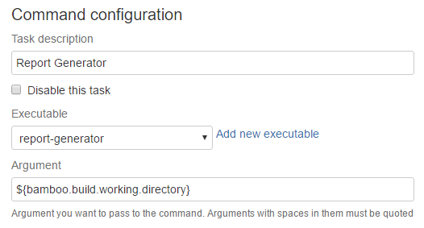

Report Generator cmd
####################

report-generator is a custom Windows batch file (cmd) configured as a command in Bamboo. It takes an Open Cover xml report and produces a html human friendly report.

OpenCover report
----------------

This script was created to use it in conjuntion with the open-cover command. Because it assume a `open-cover.xml` created in a previous step. 

Configuration
-------------

The only parameter needed is a directory. The starting point where the script will look for the open-coverl.xml file and also where it will create the ouput folder with the html report. In most cases the default directory is the Bamboo working directory then you can configure it with the ``${bamboo.build.working.directory}`` Bamboo environment variable.

Output

The output of the analysis is a `coverage-report` directory containing the html report. The directory is created at the same directory level configured in the previous step. 

You can then for example add a 7z command task to compress the folder and expose it as an artifact or deploy it to a web server.

Source code
-----------

You can find the source code in GitHub.