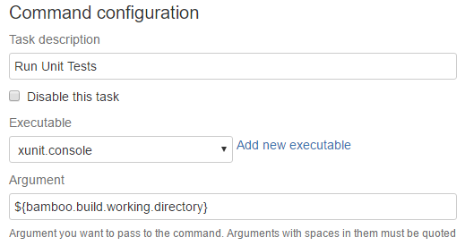
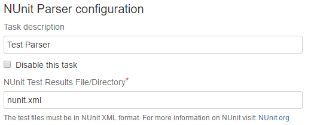

xUnit Console cmd
#################

In Bamboo we have configured a `xunit.console` command which internally runs a Windows script (cmd file). This command look for test assemblies and run all the unit tests.

File Pattern
------------

When it look for test assemblies it basically look for files that match the following pattern:

.. code-block:: bat

    \**\bin\Debug\*.Tests.dll
    \**\bin\Debug\*.Test.dll

Examples of matching assemblies:

.. code-block:: bat

     MyProject.Application.Tests.dll
     MyProject.Web.Test.dll 

Configuration
-------------

The only parameter needed is a directory. The starting point where the script will recursively start to look for test assemblies. In most cases the default directory is the Bamboo working directory then you can configure it with the `${bamboo.build.working.directory}` Bamboo environment variable.

Output
------

The output of the analysis is a `nunit.xml` file with the unit tests run results. You can find it at the same level as the working directory configured in the previous step. Following this task you can for example configure a NUnit Parser task with `nunit.xml` configured as the NUnit Test Results File.

That will allow Bamboo show the test run results in the Tests tab of every build result summary

Source code
-----------

You can find the source code in GitHub.   