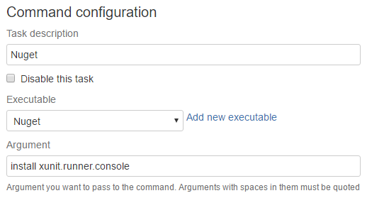

Summary
#######

XUnit console is the runner capable of running xunit tests. 

xUnit Console as a Bamboo Command
---------------------------------

Discussed with details in a different article [Link]

xUnit Console from System Path
------------------------------

xunit.console.exe is in all the Windows Agents System path. Then for example you can create a script task that calls xunit.console.exe directly.

.. code-block:: bat

     xunit.console.exe MyProject.Data.Tests.dll MyProject.Web.Tests.dll -nunit nunit.xml

xUnit Console locally
---------------------

If for some reason you need a specific version of xUnit Console (for example the latest) you can always download it locally and use it later in your build. One way to achieve that is with the Nuget command

The previous example will locally install the latest version of XUnit.Console (`xunit.runner.console.2.1.0` at the moment of this write)

Following the example you will have an `xunit.runner.console.2.1.0` directory and then you can execute xunit.console with a script task for example:

.. code-block:: bat

    xunit.runner.console.2.1.0\Tools\xunit.console.exe MyProject.Test.dll 