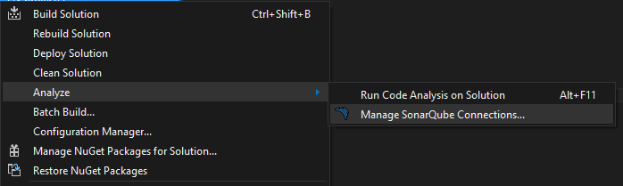
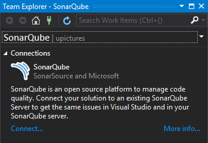
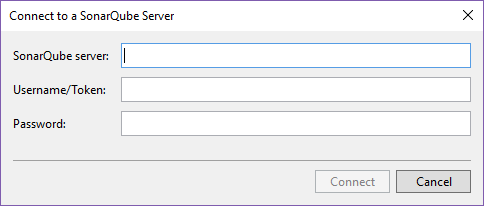
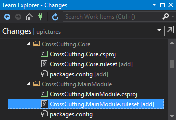
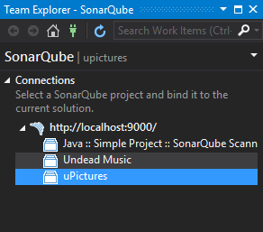
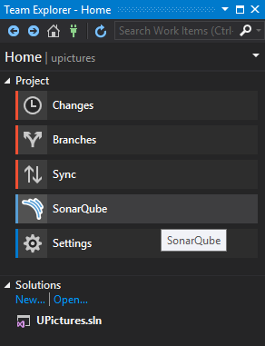
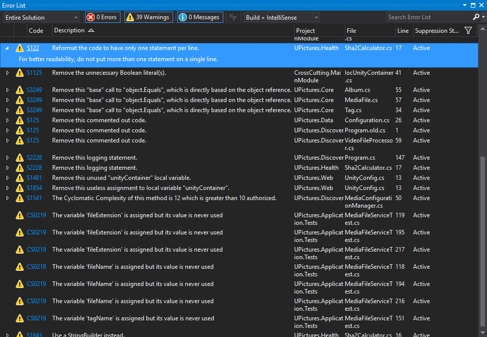

SonarLint
#########

SonarLint is an extension to your favorite IDE that provides on-the-fly feedback to developers on new bugs and quality issues injected into their code.

SonarLint for Visual Studio
---------------------------

SonarLint is a Visual Studio 2015 extension that provides on-the-fly feedback to developers on new bugs and quality issues injected into .NET code.

Download SonarLint: `https://visualstudiogallery.msdn.microsoft.com/47d1049d-bb27-454e-aab8-24566c85e548 <https://visualstudiogallery.msdn.microsoft.com/47d1049d-bb27-454e-aab8-24566c85e548>`_

Will add SonarAnalyzer.CSharp nuget package. 

.. note:: Does not include all the rules. New rules are implemented in every new version