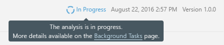

SonarQube
#########

Sonar Project Properties example
--------------------------------

.. code-block:: ini

    #required
    sonar.projectKey=isofinder
    sonar.projectName=IsoFinder
    sonar.projectVersion=1.0
    sonar.language=cs

    sonar.sourceEncoding=UTF-8

    sonar.visualstudio.enable=true

    sonar.cs.opencover.reportsPaths=opencover.xml

    sonar.sources=.

SonarRunner command line example
--------------------------------

.. code-block:: bat

    sonar-runner -D sources=. -D sonar.projectName=[project-name] -D sonar.projectKey=[project-key] -D sonar.profile=[project-profile] -D sonar.projectVersion=[project-version] -D sonar.language=[project-language] -D sonar.login=[username] -D sonar.host.url=[http://localhost:9000] -D sonar.password=[password]

SonarQube Analysis
------------------

Scope of Analysis

- On all languages, "blame" data will automatically be imported from supported SCM providers. Git and SVN are supported automatically. Other providers require additional plugins.
- On all languages, a static analysis of source code is performed (Java files, COBOL programs, etc.)
- A static analysis of compiled code can be performed for certain languages (.class files in Java, .dll files in C#, etc.)
- A dynamic analysis of code can be performed on certain languages.

Unrecognized files
------------------

By default, only files that are recognized by a language plugin are loaded into the project during analysis. For example if your SonarQube instance has the Java and JavaScript plugins on board, all .java and .js files will be loaded, but .xml files will be ignored. However, it is possible to import all text files in the analysis encoding in a project by setting Settings > Exclusions > Files > Import unknown files to true. 

During Analysis
---------------

During analysis, data is requested from the server, the files provided to the analysis are analyzed, and the resulting data is sent back to the server at the end in the form of a report, which is then analyzed asynchronously server-side.
Analysis reports are queued, and processed sequentially, so it is quite possible that for a brief period after your analysis log shows completion, the updated values are not visible in your SonarQube project. However, you will be able to tell what's going on because an icon will be added next to the project name.

Analyzing with SonarQube Scanner for MSBuild
--------------------------------------------

The SonarQube Scanner for MSBuild is the recommended way to launch a SonarQube analysis on MSBuild projects and solutions.

How to Install
--------------

MSBuild from command line: http://docs.sonarqube.org/display/SCAN/From+the+Command+Line

1. Download: `https://github.com/SonarSource-VisualStudio/sonar-msbuild-runner/releases/download/2.0/MSBuild.SonarQube.Runner-2.0.zip <https://github.com/SonarSource-VisualStudio/sonar-msbuild-runner/releases/download/2.0/MSBuild.SonarQube.Runner-2.0.zip>`_ 
2. Edit ``C:\SonarQube\bin\SonarQube.Analysis.xml`` to specify the following parameters: `sonar.host.url`, `sonar.login` and `sonar.password`

Summary
^^^^^^^

.. code-block:: bat

    MSBuild.SonarQube.Runner.exe begin /k:"org.sonarqube:csharp-simple-sq-scanner-msbuild" /n:"C# :: Simple Project :: SonarQube Scanner for MSBuild" /v:"1.0"
    MSBuild.exe /t:Rebuild
    MSBuild.SonarQube.Runner.exe end

Examples 
^^^^^^^^

    `https://github.com/SonarSource/sonar-examples/tree/master/projects/languages/csharp <https://github.com/SonarSource/sonar-examples/tree/master/projects/languages/csharp>`_

Extra parameters
^^^^^^^^^^^^^^^^

The syntax to pass additional analysis parameters is 

.. code-block:: bat

    "/d:name=value". 
    
The example below show how to set "sonar.verbose" to "true":

.. code-block:: bat

    MSBuild.SonarQube.Runner.exe begin /k:myKey /n:myName /v:myVersion /d:sonar.verbose=true

complete list of parameters: `http://docs.sonarqube.org/display/SONAR/Analysis+Parameters <http://docs.sonarqube.org/display/SONAR/Analysis+Parameters>`_

Excluding Artifacts from the Analysis
^^^^^^^^^^^^^^^^^^^^^^^^^^^^^^^^^^^^^

how to exclude projects and individual files `http://docs.sonarqube.org/display/SCAN/Excluding+Artifacts+from+the+Analysis <http://docs.sonarqube.org/display/SCAN/Excluding+Artifacts+from+the+Analysis>`_

Detection of Test Projects
^^^^^^^^^^^^^^^^^^^^^^^^^^

`http://docs.sonarqube.org/display/SCAN/Miscellaneous+Advanced+Usages <http://docs.sonarqube.org/display/SCAN/Miscellaneous+Advanced+Usages>`_

Known Limitations: 

- Analysis of BizTalk and SharePoint projects
- Analysis of ASP.NET vNext projects
- Analysis of Web Site Solutions

Analyzing with SonarQube Scanner
--------------------------------

The SonarQube Scanner is recommended as the default launcher to analyze a project with SonarQube.

`http://docs.sonarqube.org/display/SCAN/Analyzing+with+SonarQube+Scanner <http://docs.sonarqube.org/display/SCAN/Analyzing+with+SonarQube+Scanner>`_

How to Install
^^^^^^^^^^^^^^

download: `https://sonarsource.bintray.com/Distribution/sonar-scanner-cli/sonar-scanner-2.6.1.zip <https://sonarsource.bintray.com/Distribution/sonar-scanner-cli/sonar-scanner-2.6.1.zip>`_

Update the global settings (server URL) by editing <install_directory>/conf/sonar-scanner.properties:

.. code-block:: ini

    #----- Default SonarQube server
    #sonar.host.url=http://localhost:9000

You can check the basic installation by opening a new shell and executing the command 

.. code-block:: bat

    sonar-scanner -h

    INFO: usage: sonar-scanner [options]
    INFO:
    INFO: Options:
    INFO:  -D,--define <arg>     Define property
    INFO:  -e,--errors           Produce execution error messages
    INFO:  -h,--help             Display help information
    INFO:  -v,--version          Display version information
    INFO:  -X,--debug            Produce execution debug output
    INFO:  -i,--interactive      Run interactively

Usages
^^^^^^

Create a configuration file in the root directory of the project: sonar-project.properties

.. code-block:: ini

    # must be unique in a given SonarQube instance
    sonar.projectKey=my:project
    # this is the name displayed in the SonarQube UI
    sonar.projectName=My project
    sonar.projectVersion=1.0
    
    # Path is relative to the sonar-project.properties file. Replace "\" by "/" on Windows.
    # Since SonarQube 4.2, this property is optional if sonar.modules is set. 
    # If not set, SonarQube starts looking for source code from the directory containing 
    # the sonar-project.properties file.
    sonar.sources=.
    
    # Encoding of the source code. Default is default system encoding
    #sonar.sourceEncoding=UTF-8

Run sonar scanner

.. code-block:: bat

    sonar-scanner 

Example Projects: `https://github.com/SonarSource/sonar-examples <https://github.com/SonarSource/sonar-examples>`_

Advanced Usages
^^^^^^^^^^^^^^^

sonar-project.properties alternative location

If a sonar-project.properties file cannot be created in the root directory of the project, there are several alternatives:
The properties can be specified directly through the command line. Ex:

.. code-block:: bat

    sonar-scanner -Dsonar.projectKey=myproject -Dsonar.sources=src1

The property project.settings can be used to specify the path to the project configuration file (this option is incompatible with the project.home and sonar.projectBaseDir properties). Ex:
 
.. code-block:: bat
 
    sonar-scanner -Dproject.settings=../myproject.properties

Additional parameters: `http://docs.sonarqube.org/display/SONAR/Analysis+Parameters <http://docs.sonarqube.org/display/SONAR/Analysis+Parameters>`_

Root Folder

The root folder of the project to analyze can be set through the sonar.projectBaseDir property 

Analyzing with SonarQube Scanner for Maven
------------------------------------------

This analyzer is recommended to launch analysis on Java Maven project.

`http://docs.sonarqube.org/display/SCAN/Analyzing+with+SonarQube+Scanner+for+Maven <http://docs.sonarqube.org/display/SCAN/Analyzing+with+SonarQube+Scanner+for+Maven>`_

How to Install
^^^^^^^^^^^^^^

- Download `https://maven.apache.org/download.cgi <https://maven.apache.org/download.cgi>`_
- Unzip in a folder: C:\root\bin\apache-maven\
- Add `C:\root\bin\apache-maven\bin` to Path environment variable (Win+Y > Advanced system settings > Environment variables)

Edit the settings.xml file, located in $MAVEN_HOME/conf or ~/.m2, to set the plugin prefix and optionally the SonarQube server URL

.. code-block:: xml

    <settings>
        <pluginGroups>
            <pluginGroup>org.sonarsource.scanner.maven</pluginGroup>
        </pluginGroups>
        <profiles>
            <profile>
                <id>sonar</id>
                <activation>
                    <activeByDefault>true</activeByDefault>
                </activation>
                <properties>
                    <!-- Optional URL to server. Default value is http://localhost:9000 -->
                    <sonar.host.url>
                    http://myserver:9000
                    </sonar.host.url>
                </properties>
            </profile>
        </profiles>
    </settings>

Analyzing
^^^^^^^^^

.. code-block:: bat

    mvn clean verify sonar:sonar
    
    # In some situation you may want to run sonar:sonar goal as a dedicated step. Be sure to use install as first step for multi-module projects
    mvn clean install
    mvn sonar:sonar
    
    # Specify the version of sonar-maven-plugin instead of using the latest. See also 'How to Fix Version of Maven Plugin' below.
    mvn org.sonarsource.scanner.maven:sonar-maven-plugin:3.0.2:sonar

Example pom.xml

.. code-block:: xml

    <?xml version="1.0" encoding="UTF-8"?>
    <project xmlns="http://maven.apache.org/POM/4.0.0" xmlns:xsi="http://www.w3.org/2001/XMLSchema-instance" xsi:schemaLocation="http://maven.apache.org/POM/4.0.0 http://maven.apache.org/maven-v4_0_0.xsd">
        <modelVersion>4.0.0</modelVersion>

        <groupId>org.sonarqube</groupId>
        <artifactId>example-java-maven</artifactId>
        <version>1.0-SNAPSHOT</version>

        <name>Java :: Simple Project :: SonarQube Scanner for Maven</name>

        <properties>
            <project.build.sourceEncoding>UTF-8</project.build.sourceEncoding>
            <sonar.language>java</sonar.language>
        </properties>
    </project> 

Advanced Usages
^^^^^^^^^^^^^^^

Excluding a module from SonarQube analysis. You can either:

- define property <sonar.skip>true</sonar.skip> in the pom.xml of the module you want to exclude
- use build profiles to exclude some module (like for integration tests)
- use `Advanced Reactor Options <http://blog.sonatype.com/2009/10/maven-tips-and-tricks-advanced-reactor-options/>`_ (such as "-pl"). For example mvn sonar:sonar -pl !module2

