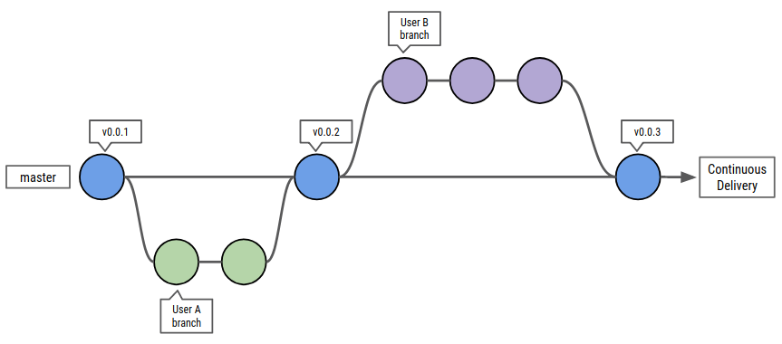

.. ATeam Docs documentation master file

How to contribute
-----------------

1. clone the repository: `https://github.com/mamcer/sphinx-docs <https://github.com/mamcer/sphinx-docs>`_
2. create a branch from master
3. add awesome content
4. request a branch merge to master
5. see your awesomeness: [host-server-url] 

.. note:: User A & User B could be you!

Contents:
---------

.. toctree::
    :titlesonly:

    01-build/index
    02-test/index
    03-deploy/index
    04-inspect/index
    05-tools/index
    06-etc/index
    
Indices and tables
==================

* :ref:`search`